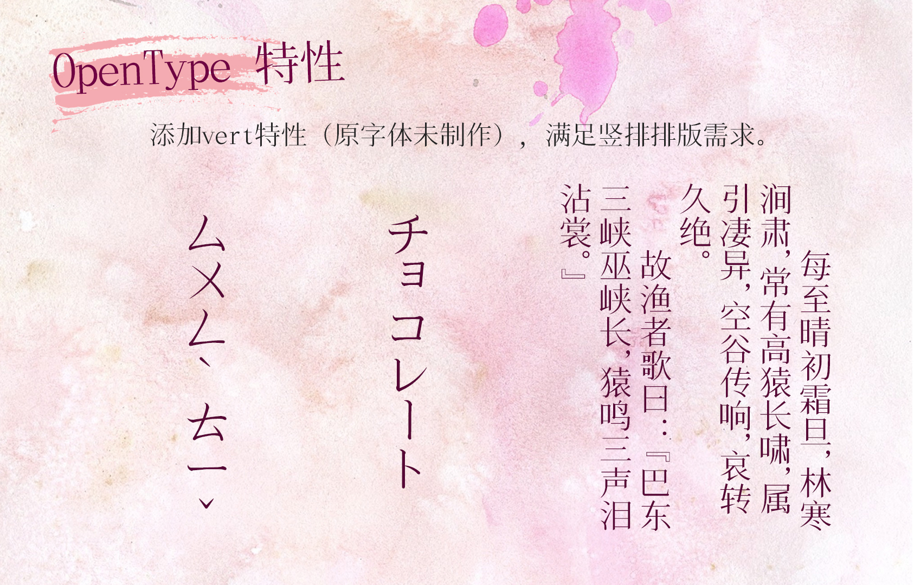
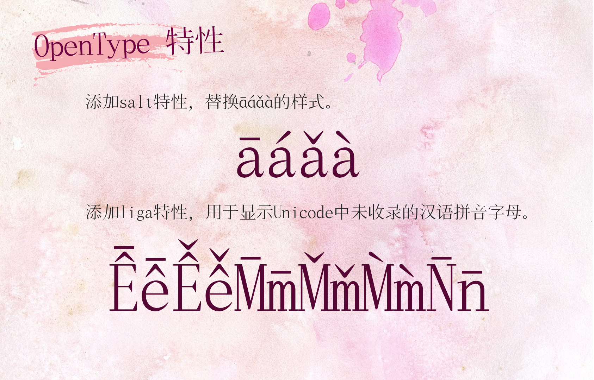
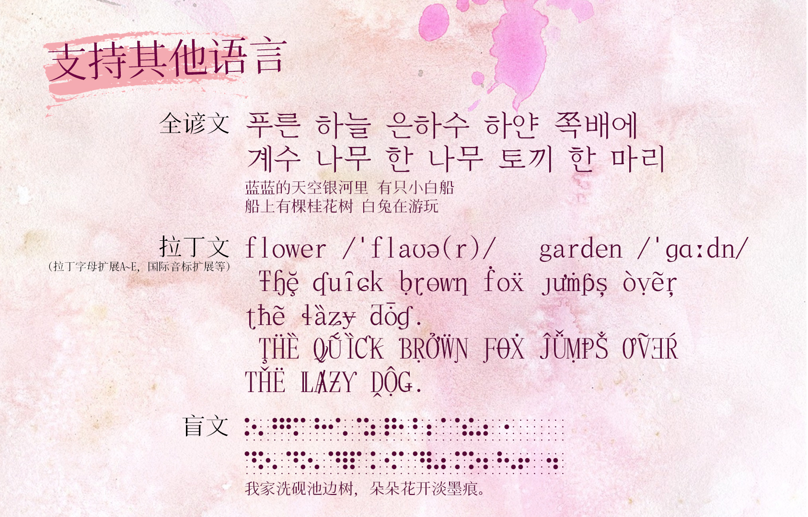
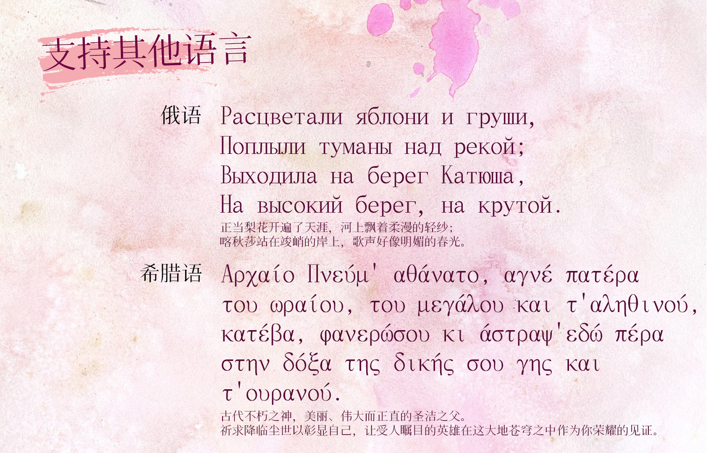

# 欢迎来到《飞花宋体》的新仓库！

## 简介

[花园明朝](http://fonts.jp/hanazono/)是一款免费字体，为GlyphWiki（字形维基）所开发，几乎收录了所有汉字字形。缺点是字形以日本字形为准，有一些字不符合中文书写规范（不论是大陆规范还是港台规范）。在我了解到了字形维基这个网站后，我决定将花园明朝体改成适合大陆实用的版本。

我保留了“花园”的“花”字，另起名为《飞花宋体》，英文名为“FlyFlowerSong”。《飞花宋体》除了支持简体汉字之外，还支持俄语、希腊语、韩语、拉丁语、盲文以及中学阶段涉及的数学符号，未来如果有可能还会收录少数民族的语言文字。

## 字体预览

 

### 严格按照国标（G源）字形修改并进行优化

除《通用规范汉字表》、GB/T 2312、《现代汉语通用字表》外，还收录了第七版《现代汉语词典》单字条目的所有汉字，并酌情增补各类方言、各专门领域之常用汉字，并全部改为国标（G源）字形。收录汉字数总计超过2万，基本满足简体中文使用需求。

> 修改、优化记录请于[站酷文章](https://www.zcool.com.cn/article/ZMTIzNjQyNA==.html)浏览。
> 
> 注意：为了避免文件过大，我删去了繁体字和一些使用频率极少的符号，如果介意请继续使用花园明朝体。

### 优化字母与符号

对i、j的点、句号、半浊点等空心、圆圈类符号以及其他过粗的符号进行改薄、优化处理，优化与汉字搭配的效果。

### Opentype特性
原字体未制作任何Opentype特性。

> 若有其他需求，欢迎于[issue页面](https://github.com/Skr-ZERO/FlyFlowerSong/issues)提出。

### 支持其他语言

## 授权信息

根据字形维基的[著作权与许可协议](http://zhs.glyphwiki.org/wiki/GlyphWiki:%e8%91%97%e4%bd%9c%e6%9d%83%e4%b8%8e%e8%ae%b8%e5%8f%af%e5%8d%8f%e8%ae%ae)，任何人都可以自由使用在字形维基（GlyphWiki）提交的字形数据及文章内容。不论一切针对数据的改变或商业用途，任何人都可以自由地使用、复制甚至转载上述的一切数据和内容。

本字体遵循上述授权信息。

### 允许
- 一切商业使用；
- 转载、分享字体文件；
- 将字体文件嵌入软件中；
- 修改字体或制作衍生版本，衍生字体也需遵循上述授权信息。

### 不允许
- 将该字体作为商品进行售卖或进行变相收费（包括但不限于积分下载，与其他字体捆绑售卖，设置任何权限门槛等）；
- 用于违反国家法律和公序良俗的任何场景；
- 在制作衍生字体时，名称出现“飞花”“FlyFlower”等字样。

若对本字体有意见或问题，欢迎于[issue页面](https://github.com/Skr-ZERO/FlyFlowerSong/issues)提出。

## 下载通道

进入[“Release”界面](https://github.com/Skr-ZERO/FlyFlowerSong/releases)下载对应版本的 TTF 或 OTF 文件。

## 致谢

- [字形维基](http://zhs.glyphwiki.org/wiki/GlyphWiki:%e9%a6%96%e9%a1%b5) 提供制作字体的平台，字形维基用户制作字形。
- 所有下载使用的朋友。

## 打赏支持

## Star数趋势图

